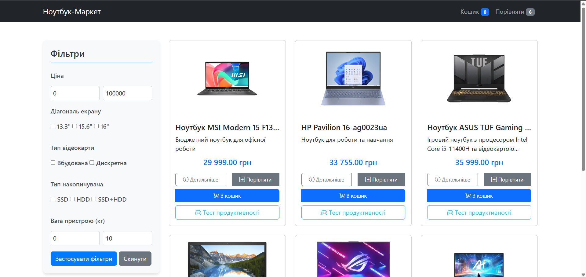

# Ноутбук-Маркет (Laptop Market)

Комплексна платформа електронної комерції для перегляду та придбання ноутбуків із повноцінною системою кошика та функціоналом обробки замовлень.



## Функціональність

Проект реалізує стандартний функціонал інтернет-магазину:

- **Перегляд каталогу**: Огляд усіх доступних ноутбуків з можливістю фільтрації (`index.php`)
- **Деталі продукту**: Доступ до детальної інформації про кожен ноутбук (`product.php`)
- **Управління кошиком**: Додавання, видалення та оновлення кількості товарів (`cart.php`)
- **Процес оформлення замовлення**: Завершення покупок із збором інформації про клієнта (`checkout.php`)
- **Управління запасами**: Перевірка наявності товару в реальному часі
- **Сповіщення користувача**: Інтерактивні повідомлення при додаванні товарів до кошика

## Запуск проекту локально

1. Клонуйте репозиторій
```bash
git clone https://github.com/Viktor-pixel-scet/Online-store-of-laptops.git
cd Online-store-of-laptops
```

2. Налаштуйте веб-сервер (Apache/Nginx) для обслуговування каталогу проекту
3. Імпортуйте базу даних з файлу `laptop_market.sql`
4. Налаштуйте підключення до бази даних у файлі `backend/database/Database.php`
5. Відкрийте проект у браузері

## Принципи програмування

1. **DRY (Don't Repeat Yourself)**
    - Усі повторювані елементи (навігаційне меню, підвал) винесені у єдину структуру HTML
    - Функції обробки кошика централізовані в `cart.php`
    - Повторювані запити до бази даних інкапсульовані в репозиторіях

2. **KISS (Keep It Simple, Stupid)**
    - Проста та зрозуміла структура проекту без надмірних абстракцій
    - Лаконічний та читабельний код з мінімумом складності
    - Чіткий поділ на функціональні компоненти

3. **Принцип єдиної відповідальності (Single Responsibility Principle)**
    - Кожен файл має чітко визначену область відповідальності:
        - `Database.php` — підключення до бази даних
        - `ProductRepository.php` — операції з даними про товари
        - `cart.php` — логіка роботи з кошиком
        - `checkout.php` — обробка оформлення замовлення

4. **Принцип розділення відповідальності (Separation of Concerns)**
    - Чіткий поділ на логічні шари:
        - Доступ до даних (PDO та репозиторії)
        - Бізнес-логіка (сервіси та обробники)
        - Представлення (HTML шаблони)
        - Стилізація (CSS/Bootstrap)
        - Клієнтська взаємодія (JavaScript)

5. **Fail Fast**
    - Раннє виявлення помилок через валідацію даних на всіх етапах
    - Перевірка наявності товарів одразу при додаванні до кошика
    - Чіткі повідомлення про помилки для користувачів та розробників

6. **YAGNI (You Aren't Gonna Need It)**
    - Проект містить лише необхідні функції без надлишкового коду
    - Кожна функція має чітке призначення та використання

## Шаблони проектування

1. **Шаблон Front Controller**  
   Централізована обробка всіх запитів, пов'язаних з кошиком, через єдину точку входу. Забезпечує структурований підхід до маршрутизації та обробки запитів.  
   **Файл:** [`cart.php`](backend/orders/cart.php)

2. **Шаблон Repository**  
   Інкапсуляція логіки доступу до даних в окремих класах-репозиторіях для продуктів, замовлень і клієнтів. Забезпечує абстракцію від конкретної реалізації бази даних.  
   **Файли:** [`ProductRepository.php`](backend/repositories/ProductRepository.php), [`OrderRepository.php`](backend/repositories/OrderRepository.php), [`CustomerRepository.php`](backend/repositories/CustomerRepository.php)

3. **Шаблон Service**  
   Реалізація бізнес-логіки в сервісних класах, відокремлених від репозиторіїв та контролерів. Забезпечує чистоту архітектури та повторне використання коду.  
   **Файл:** [`OrderService.php`](backend/services/OrderService.php)

4. **Шаблон Observer**  
   JavaScript-реалізація для відстеження подій додавання товарів у кошик та оновлення інтерфейсу без перезавантаження сторінки.  
   **Файли:** [`cart.js`](public/assets/js/features/cart.js), [`main.js`](public/assets/js/ui/main.js)

5. **Шаблон DTO (Data Transfer Object)**  
   Використання спеціальних об'єктів для передачі даних між шарами застосунку, що забезпечує структуровану передачу інформації.  
   **Файл:** [`OrderDTO.php`](backend/dto/OrderDTO.php)

## Техніки рефакторингу

1. **Екстракція методу**  
   Виділення повторюваних фрагментів коду в окремі функції для підвищення читабельності та можливості повторного використання.  
   **Приклад:** Функція `showAddToCartMessage()` в `cart.php`

2. **Інкапсуляція поля**  
   Обмеження прямого доступу до даних сесії (`$_SESSION['cart']`) шляхом створення спеціальних методів доступу і модифікації.  
   **Файли:** [`cart.php`](backend/orders/cart.php), [`storageManager.js`](public/assets/js/core/storageManager.js)

3. **Заміна умовного оператора поліморфізмом**  
   Використання структури `switch` або окремих блоків `if` замість складних умовних конструкцій для різних операцій з кошиком.  
   **Файл:** [`cart.php`](backend/orders/cart.php)

4. **Впровадження контролера**  
   Централізація обробки запитів через параметр `action` для підвищення гнучкості та масштабованості системи.  
   **Файли:** [`cart.php`](backend/orders/cart.php), [`process_order.php`](public/process_order.php)

5. **Використання підготовлених запитів**  
   Застосування підготовлених запитів PDO замість прямого впровадження значень у SQL для підвищення безпеки та захисту від SQL-ін'єкцій.  
   **Файл:** [`Database.php`](backend/database/Database.php)

6. **Видалення дублювання коду**  
   Усунення повторюваних фрагментів коду за допомогою виділення спільної функціональності в повторно використовувані компоненти.  
   **Файли:** [`productFilter.js`](public/assets/js/features/productFilter.js), [`quantityManager.js`](public/assets/js/ui/quantityManager.js)

## Технології

- **Бекенд**: PHP 7.4+
- **Фронтенд**: HTML5, CSS3, JavaScript (ES6+)
- **База даних**: MySQL
- **CSS-фреймворк**: Bootstrap 5
- **Керування версіями**: Git

## Структура проекту

```
Online-store-of-laptops/
├── backend/
│   ├── database/
│   │   └── Database.php
│   ├── dto/
│   │   └── OrderDTO.php
│   ├── orders/
│   │   └── cart.php
│   ├── products/
│   │   └── product.php
│   ├── repositories/
│   │   ├── CustomerRepository.php
│   │   ├── OrderRepository.php
│   │   └── ProductRepository.php
│   ├── services/
│   │   └── OrderService.php
│   └── utils/
│       └── compare.php
├── public/
│   ├── assets/
│   │   ├── css/
│   │   │   ├── gallery.css
│   │   │   └── style.css
│   │   └── js/
│   │       ├── core/
│   │       │   ├── errorHandler.js
│   │       │   └── storageManager.js
│   │       ├── features/
│   │       │   ├── cart.js
│   │       │   ├── gameTest.js
│   │       │   ├── productComparison.js
│   │       │   └── productFilter.js
│   │       └── ui/
│   │           ├── imageHandlers.js
│   │           ├── quantityManager.js
│   │           └── main.js
│   ├── index.php
│   ├── order_confirmation.php
│   └── process_order.php
├── laptop_market.sql
└── README.md
```

## Автор
 - Малівський Віктор. ІПЗ-23-5

Проєкт розроблено як лабораторна робота №6 з КПЗ

